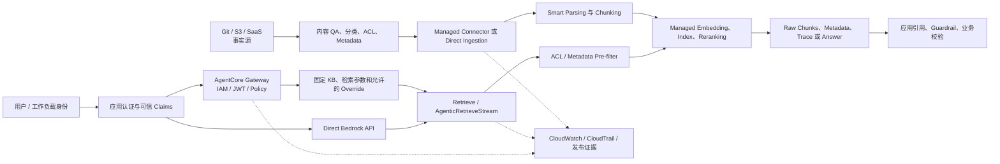
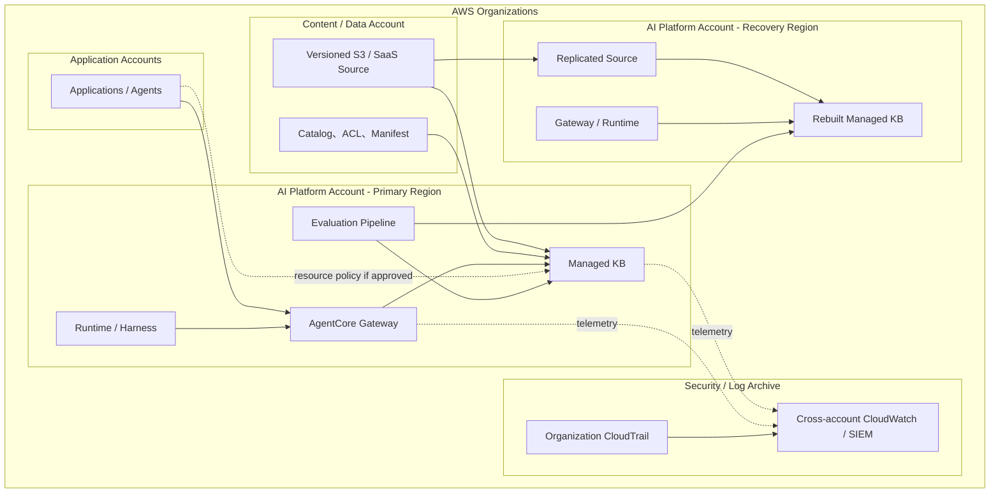

# Amazon Bedrock Managed Knowledge Base 企业治理蓝图

复核日期：2026-08-05

## 1. 目标、范围与证据

本蓝图面向 AI Platform、Security、IAM、Data Governance、Application Owner
和内容 Owner，定义 Amazon Bedrock Managed Knowledge Base（下称 Managed KB）
如何作为企业共享检索能力被设计、发布和运营。

一句话心智模型：

> Managed KB 是由 Amazon Bedrock 托管解析、索引、存储与检索基础设施的区域性
> RAG 数据平面；它降低向量基础设施运维，但不替代事实源、最终授权、内容治理、
> 质量评测和应用生成逻辑。

规范词：

- `MUST`：进入生产环境必须满足。
- `SHOULD`：默认应满足；偏离需要记录原因和补偿控制。
- `MAY`：按场景选择。

证据等级：

1. **AWS 服务事实**：Developer Guide、Release Notes、API Reference、Pricing。
2. **AWS 推荐**：AWS 官方博客、Well-Architected 和 Prescriptive Guidance。
3. **本项目实测**：本仓库在指定账户、Region、语料和日期下的结果。
4. **本项目建议**：架构判断，不代表 AWS 产品承诺。
5. **待验证假设**：尚无足够证据，不能进入生产设计前提。

本蓝图不把 AWS sample 当作生产合规证明，也不替代企业的数据分类、IAM、
保留、Legal Hold、事件响应和业务审批制度。

## 2. 服务定位与边界

### 2.1 它解决什么

**AWS 服务事实：**

- 托管原始数据、文本、Metadata、Embedding、索引和检索基础设施。
- 提供 S3、SharePoint、Confluence、Google Drive、OneDrive、Web Crawler 和
  Custom 等原生 Connector。
- 提供 Smart Parsing、多模态内容处理、Hybrid Search、Managed Reranking、
  Metadata Filter、ACL-aware filtering 和 Agentic Retrieval。
- 可直接通过 Bedrock Runtime API 调用，也可作为 AgentCore Gateway 的 MCP
  Connector Target。
- 支持 Resource Policy，让其他账户调用 `Retrieve` 和
  `GetDocumentContent`。

### 2.2 它不解决什么

**本项目建议：**

- 不承担最终用户认证。ACL awareness 只按调用方提供的可信 User Context 过滤。
- 不自动继承 S3、SharePoint 或其他事实源的 IAM 权限成为应用授权。
- 不保证生成答案正确；`Retrieve` 返回证据，生成与引用仍由应用或 Agent 负责。
- 不取代内容 Owner、审批、版本、生效期、过期和删除治理。
- 不提供客户可直接管理的向量数据库、索引快照或跨 Region 自动复制。
- 不保证 Agentic Retrieval 一定追加检索；迭代数是上限，不是执行承诺。
- Guardrails 不等于租户隔离、业务授权或源数据脱敏。

### 2.3 五个容易混淆的概念

1. **Managed KB 不是 AgentCore 独立资源类型**：资源由 Amazon Bedrock
   `bedrock-agent` 控制面创建，但可原生接入 AgentCore Gateway 和 Observability。
2. **Managed Storage 不等于事实源**：服务内索引是派生状态，S3/CMS/Drive 和
   发布 Manifest 才是可重建的权威状态。
3. **Metadata Filter 不等于认证**：Filter 只有在值来自可信身份上下文且
   Fail Closed 时，才能成为授权链的一部分。
4. **Agentic Retrieval 不等于自动获得更高质量**：复杂查询可能受益，但也增加
   规划模型、迭代检索、延迟和成本。
5. **PrivateLink 不等于授权**：私网路径降低网络暴露，IAM、Resource Policy、
   Gateway Policy 和文档级过滤仍然必须存在。

## 3. 资源、控制面、数据面与身份

| 边界 | 主要对象或 API | Owner | 关键风险 |
| --- | --- | --- | --- |
| 控制面 | Knowledge Base、Data Source、Ingestion Job、Resource Policy、Tags | KB Platform Owner | 误配置、越权创建、删除、模型或 Connector 漂移 |
| 摄入数据面 | S3/CMS Connector、`IngestKnowledgeBaseDocuments`、`DeleteKnowledgeBaseDocuments` | Content Owner + KB Platform | 乱码、陈旧、Metadata/ACL 缺失、异步失败 |
| 检索数据面 | `Retrieve`、`GetDocumentContent`、`AgenticRetrieveStream` | Application Owner | 越权、低召回、敏感 Raw Chunk、限流 |
| Gateway 数据面 | MCP `Retrieve` / `AgenticRetrieveStream` Tool | Gateway Owner | 参数暴露、身份丢失、绕过 Gateway |
| 模型数据面 | 自定义 Embedding、Reranker、Planner 或生成模型调用 | Model Platform + Application | 模型 Region、配额、成本、非确定性 |
| 事实源 | Git、S3、SharePoint、Confluence、Drive、CMS | Content Owner | 内容错误、权限漂移、删除与 Legal Hold |
| 审计面 | CloudTrail、CloudWatch、AgentCore Observability、发布证据 | Security + Platform | 缺失 Data Events、敏感日志、无法关联 |

调用者与责任：

- KB service role 代表 Amazon Bedrock读取数据源和调用客户选择的模型。
- 直接调用方的 IAM principal 负责获得 `Retrieve` 等权限。
- Gateway execution role 代表 Gateway 调用指定 KB；Runtime role 只需调用
  Gateway，不应同时获得绕过 Gateway 的 KB 权限。
- 应用负责验证最终用户身份，并从受信 Claims 构造 Metadata Filter 或 User
  Context。
- 数据系统和应用共同承担最终授权；模型输出不能授予权限。

## 4. 请求与数据流

确定性基础设施控制包括 IAM、Resource Policy、SCP、KMS Key Policy、Gateway
Target 参数、Metadata Filter、删除与保留流程。依赖模型或概率行为的部分包括
Smart Parsing、Embedding、Rerank、Agentic Query Planning、充分性判断和生成。
后者 `MUST` 通过 Golden Set 和持续评测管理，不能被描述为硬性控制。

## 5. 企业多账户与多 Region 架构

### 5.1 账户边界

- 生产 KB `MUST` 位于有明确 Platform Owner 的账户，不能由个人 Sandbox
  账户长期承载。
- 高敏内容 `SHOULD` 让事实源账户与检索平台账户分离，并使用精确的 Bucket
  Policy、KMS Policy 和 service role。
- 跨账户调用 `MUST` 同时满足 KB Resource Policy 和调用方 Identity Policy。
- Resource Policy `MUST` 授权具体 Role ARN；除非有额外约束，不向整个账户
  `root` 开放。
- 组织 `SHOULD` 使用 SCP 限制未批准 Region、公共实验账户和高敏 Bucket 上的
  KB 创建与数据源连接。

### 5.2 Region 与数据驻留

截至 2026-08-04，AWS 官方公布 Managed KB 位于：

- `us-east-1`、`us-west-2`
- `eu-west-1`、`eu-central-1`、`eu-west-2`
- `ap-southeast-2`、`ap-northeast-1`
- `us-gov-west-1`

能力会变化，上线前 `MUST` 复核目标 Region 的 KB、Connector、模型、Gateway、
KMS 和 PrivateLink 支持。Managed KB 是 Region 资源；多 Region `MUST` 独立
创建 KB、Data Source、Gateway、IAM、KMS、告警并重新摄入。不能假设服务内部
索引自动跨 Region 复制。

### 5.3 多租户

以下任一条件成立时 `MUST` 拆分 KB：

- 不同法律实体、监管域、数据驻留或 KMS Key Owner。
- 调用方 IAM principal 集合不能共享。
- 无法接受 Filter 误配导致的共同 Blast Radius。
- 不同内容保留、删除、Legal Hold 或灾难恢复要求。

同一信任域内可使用单 KB 多 Data Source，但 `MUST`：

- 使用来自可信身份的 tenant/department/classification Filter。
- 对空结果、缺失字段或 Filter 构造失败执行 Fail Closed。
- 执行跨租户正向、负向和绕过测试。
- 限制直接 `Retrieve` 权限，避免调用者绕过应用 Filter。

## 6. 与相邻服务的责任边界

| 服务 | 主要责任 | 与 Managed KB 的边界 |
| --- | --- | --- |
| AgentCore Gateway | MCP 入口、IAM/JWT、固定 Target 参数、Policy、统一审计 | 不拥有内容；Gateway 授权不能替代文档范围控制 |
| Runtime / Harness | 执行 Agent loop、会话、模型与 Tool 调用 | 应只获得所需 Gateway/KB 权限；负责处理检索失败 |
| AgentCore Identity | 工作负载和用户身份、令牌交换 | 身份 Claims 必须可信地映射为 KB User Context/Filter |
| AgentCore Policy | Gateway Tool 与参数的确定性授权 | 可限制谁调用哪个 KB Tool，但不能判断 Chunk 业务权限 |
| AgentCore Observability | AgentCore service telemetry 与 Agent Trace 展示 | Transaction Search、vended log delivery 和应用 ADOT 需分别配置；必须与 KB CloudWatch、CloudTrail 关联 |
| AgentCore Registry | 设计时资产发现、Owner、版本和审批 | 不替代 Gateway Target 或 KB Resource Policy |
| AgentCore Evaluations | Agent 级在线/离线质量评测 | KB 仍需 Retrieve-only、ACL、Freshness 和 Citation 回归 |
| Bedrock Guardrails | 输入、内容和生成安全 | 不替代认证、Metadata ACL、租户隔离和源数据脱敏 |
| Bedrock Model API | Planner、生成和自定义模型调用 | 模型 Region、配额和成本与 KB 存储费用分开治理 |
| IAM / Organizations | Principal、Role、SCP、跨账户授权 | 是资源级硬边界；Metadata Filter 是数据面附加控制 |
| KMS / Secrets Manager | 数据密钥与 Connector Secret | Key/Secret 生命周期由客户治理，不能进入日志或代码 |
| CloudWatch / CloudTrail | 指标、日志、Trace 和 API 审计 | Runtime Data Events 需要显式启用并评估成本 |
| VPC / PrivateLink | 私有 API 路径、DNS 和 Endpoint Policy | 不改变最终 IAM/Resource Policy 判定 |
| Lambda / Step Functions | 可选的事件编排、验证和发布门禁 | 不是基础摄入必需项；使用时必须幂等和可恢复 |
| API Gateway | 面向客户端的 API 产品、配额、版本、WAF | 可封装应用 API，不替代 KB 或 AgentCore Gateway |

## 7. 与 AgentCore Gateway 的跨服务契约

| 契约 | Gateway 责任 | Managed KB 责任 | 调用方责任 | 最低证据 |
| --- | --- | --- | --- | --- |
| 身份传播 | 验证 IAM/JWT；限制可见参数 | 按收到的 User Context/Filter 执行过滤 | 认证用户并只从可信 Claims 构造上下文 | JWT/IAM 配置、正负查询 |
| 最终授权 | 决定能否调用 KB Tool | IAM/Resource Policy 与文档过滤 | 数据层和应用承担最终授权 | Policy、IAM、泄漏率报告 |
| 网络路径 | 保护 MCP 入口和 Target 调用 | 提供 Bedrock Regional Endpoint | 使用批准的 PrivateLink/公网路径 | 网络图、VPCE Policy |
| 数据分类 | 不允许 Agent 覆盖固定治理参数 | 存储并返回分类 Metadata | 内容入库前分类和脱敏 | Metadata 字典、抽样响应 |
| 会话/状态 | 管理 MCP/Agent 会话和 Tool 参数 | Retrieve 无业务会话；Agentic 可接收消息历史 | 管理用户会话、超时和撤权 | Session 测试、撤权测试 |
| 重试/幂等 | Tool 调用有界重试 | API 返回明确错误和 Throttle | 避免重复生成或重复副作用 | 重试测试、错误分类 |
| 日志/Trace | 记录 Gateway Request/Target Trace | 发布 KB 指标和 Agentic Trace | 注入 Correlation ID，脱敏日志 | 一次跨服务 Trace |
| 配额/成本 | 管理 Gateway TPS 和调用成本 | 管理 KB RPM、存储和 Agentic 成本 | 控制 Top-K、迭代、生成 Token | 配额快照、成本看板 |
| 版本/兼容 | 固定 Connector Tool 和 Override Schema | 维护 KB、Data Source 和 API 版本 | 固定 SDK，执行契约测试 | Sample/SDK SHA、测试 |
| 故障与回滚 | 切换 Target 或停止暴露 Tool | 保留前一 KB/Data Source 可检索 | 触发回滚并验证陈旧内容排除 | 回滚记录、Golden Set |

防绕过要求：

- 选择 Gateway 为强制治理入口时，Runtime role `MUST NOT` 同时拥有直接
  `bedrock:Retrieve` 权限。
- KB Resource Policy `MUST NOT` 向未受 Gateway 约束的广泛 Principal 开放。
- Gateway Target 的 KB ID、Retriever 列表、Filter 基线、Reranker 和迭代上限
  `SHOULD` 由管理员固定，只暴露最小必要 `parameterOverrides`。
- Gateway 入口授权与 KB 文档过滤 `MUST` 分别测试；两者重复实现 tenant 规则时，
  必须指定唯一 Source of Truth 和一致性检查。

## 8. 身份、授权与 Confused Deputy

- KB service role `MUST` 使用 `bedrock.amazonaws.com` 信任，并包含
  `aws:SourceAccount` 和限定 KB ARN 的 `aws:SourceArn`。
- 创建阶段因 KB ID 未知使用通配 ARN 时，创建后 `MUST` 收紧到具体 KB。
- S3 权限 `MUST` 限定具体 Bucket 和 Prefix；KMS 权限限定具体 Key。
- Connector Secret `MUST` 位于 Secrets Manager，权限限定具体 Secret ARN。
- 自定义模型权限 `MUST` 限定批准的模型或 inference profile。
- `AgenticRetrieveStream` 无法资源级收敛的 Action `MUST` 记录 IAM 限制和
  Gateway/应用补偿控制。
- 应用 `MUST` 拒绝客户端或模型直接提交 tenant、role、classification、
  allowed_groups 等授权字段。
- ACL awareness `MUST` 配合上游认证、身份规范化、离职撤权和 Email Reuse
  治理，不得作为唯一授权。

## 9. 网络、加密与数据治理

### 9.1 网络

- 私有工作负载 `SHOULD` 使用 `bedrock-agent`、`bedrock-agent-runtime`、
  `bedrock-runtime` 等适用 Interface VPC Endpoint。
- Endpoint Policy `SHOULD` 限制 Principal、Action 和 KB ARN。
- PrivateLink `MUST NOT` 被用于省略 IAM、Resource Policy 或应用授权。
- SaaS Connector 的出站路径、域名、证书、代理和数据驻留 `MUST` 单独审查。

### 9.2 加密与数据

- 受监管数据 `MUST` 评估 Customer-managed KMS Key，并治理 Key Policy、
  Rotation、Disable/Delete 和 Grant 监控。
- S3 源、临时摄入数据、Managed Store、日志和评测证据的加密边界
  `MUST` 分别记录。
- PII/PHI、Secret 和高敏标识 `MUST` 在摄入前删除、Tokenize 或脱敏。
- Raw Retrieved References 可能包含原文；应用 `MUST NOT` 默认完整记录。
- Metadata `MUST` 有字段 Owner、类型、允许值、授权语义、Embedding Policy、
  保留、删除和 Schema Version。
- Vector Index `MUST` 被视为派生状态；事实源、Manifest、Checksum 和发布记录
  必须足以重建。

### 9.3 保留与删除

- 内容删除 `MUST` 同时覆盖事实源、直接摄入状态、Connector Index 和缓存。
- `DeleteKnowledgeBaseDocuments` 可用于定向删除；`StartIngestionJob` 可用于
  Connector 对账。两条路径都 `MUST` 等待最终文档状态并运行 stale-content
  回归。
- Legal Hold `MUST` 在事实源先执行，不能只依赖向量索引保留。
- KB/Data Source 退役前 `MUST` 导出配置、证据和内容清单，并验证没有调用方。

## 10. 质量、Guardrails 与人工介入

- Parser、Chunking、Embedding、Reranker、Metadata Schema 和 Query 配置
  `MUST` 独立版本化。
- 每次发布 `MUST` 执行 Retrieve-only Golden Set、ACL Leakage、Freshness、
  No-answer 和 Citation 回归。
- 结构复杂、扫描或多模态文档 `MUST` 抽样验证 Smart Parsing；解析失败时应预
  抽取 canonical UTF-8 Markdown/HTML，而不是依赖生成模型补救。
- Guardrails `MAY` 处理 Prompt Attack、有害内容和敏感输出，但 `MUST NOT`
  作为文档授权或业务批准。
- Agentic Retrieval 仅支持 `BLOCK` Guardrail Action；需要 Mask 时应在摄入前
  脱敏或由受信应用处理。
- 法规、医疗、金融或生产操作类答案 `SHOULD` 配置人工复核阈值和可追溯引用。

## 11. 可观测性、审计与事件响应

详细实现、实验模板、长期分析和官方依据见
[AgentCore 与 Managed KB 可观测性蓝图](OBSERVABILITY_BLUEPRINT.md)。

生产环境 `MUST` 建立：

- `AWS/Bedrock/KnowledgeBases` 指标：调用量、客户端/服务端错误、Throttle；
  Agentic 请求额外记录 `TotalIterationCount`。
- 摄入日志：文档成功、失败、跳过及原因。
- AgentCore service trace 所在账户和 Region 的 CloudWatch Transaction Search；
  它不是单个 Gateway 自动开启的属性。
- Gateway、Memory 等资源的显式 vended log delivery inventory；Runtime 默认日志
  不能证明其他资源已配置日志。
- 自定义 Agent、Proxy 和应用业务步骤的 ADOT/OTEL instrumentation 状态；服务
  telemetry 不能替代 prompt 版本、路由、重试和业务 KPI。
- CloudTrail Management Events：KB、Data Source、Resource Policy、Ingestion。
- CloudTrail Data Events：`Retrieve`、`GetDocumentContent` 和适用 Runtime
  调用；Data Events 不是默认完整审计，需显式配置。
- 应用指标：p50/p95/p99 latency、Top-K、Filter、零结果、ACL deny、Freshness、
  Citation 和单请求成本。
- 关联键：request ID、trace ID、session ID、principal、tenant、KB、Data
  Source、document/chunk ID、corpus version 和 release ID。
- 观测 Pipeline 指标：delivery failure、throttle、retry exhaustion、lag 和
  长期分析 Schema 拒绝。

每次实验和发布 `MUST` 同时执行成功路径和可控失败路径，并分别给出 Metrics、
Logs、Traces 证据；某类信号不适用时记录 `N/A`，未配置或无法取得时记录 `GAP`，
不得把“没有证据”解释为“没有错误”。同一请求必须能使用 request/session/trace
ID 跨适用服务关联。

需要跨月质量、可靠性和成本分析时，`SHOULD` 采用 CloudWatch Logs ->
Data Firehose -> S3 Tables/Iceberg。Firehose 仅承担缓冲、转换和投递，S3
Tables 承担长期表分析；`trace_id` 等高基数字段不得作为分区键。Schema、KMS、
留存、删除、Legal Hold、Firehose error backup 和 Iceberg table maintenance
必须独立治理。

事件响应 `MUST` 包括：

1. 暂停 Gateway Target 或撤销直接调用 Principal。
2. 对错误内容使用 Filter/隔离 Data Source 快速止血。
3. 撤销 Connector Secret 或 KMS Grant。
4. 保留 CloudTrail、Trace、发布 Manifest 和原始响应证据。
5. 从前一语料版本或恢复 Region 重建并执行回归。
6. 复核是否存在 Raw Chunk、日志、缓存或下游生成内容泄漏。

Break-glass Role `MUST` 有 MFA、短时凭证、审批、告警和事后复核，不能作为日常
摄入或检索身份。

## 12. 可靠性、配额、性能与灾难恢复

截至 2026-08-04，官方 Managed KB 默认配额包括：

| 配额 | 默认值 |
| --- | ---: |
| 每账户每 Region Managed KB | 10,000 |
| 每 KB Data Source | 200 |
| 每 KB 并发 Ingestion Job | 50 |
| 每 KB Raw Data Storage | 10 TB |
| 每 KB `Retrieve` | 600 requests/minute |
| 每账户 `AgenticRetrieveStream` | 60 requests/minute |
| 英文 Query 输入 | 10,000 characters |

上线前 `MUST` 重新读取 Service Quotas，并对目标账户执行压测。不能用并发
Ingestion Job/KB 推导同一个 Data Source 可并发执行多个 Job。

可靠性要求：

- Direct Ingest/Delete `MUST` 轮询每份文档最终状态，不能将 API `ACCEPTED`
  当成发布成功。
- `StartIngestionJob` `MUST` 等待 `COMPLETE/FAILED` 并检查 failed/skipped。
- 重试仅覆盖 Throttle、Timeout、5xx 和可恢复依赖错误；Validation、Access
  Denied 和 Schema 错误不得盲目重试。
- 发布 Manifest 只在摄入、ACL、检索、Freshness 门禁全部通过后原子提升。
- DR `MUST` 从版本化事实源和 IaC 重建，定义并实测 RTO/RPO。
- 多 Region `SHOULD` 使用 S3 Replication 或等价内容同步，但每个 Region 的
  KB 索引必须独立摄入和验证。

## 13. 成本治理

截至 2026-08-04，AWS Bedrock Pricing 的美国 Region 示例价格为：

- Managed Index Storage：`$5.00 / GB-month`。
- Standard Retrieval：`$1.00 / 1,000` calls。
- Agentic Retrieve：`$4.00 / 1,000` calls。
- Agentic Retrieval 内部触发的 Retrieve 仍按 Standard Retrieval 计费。
- Managed Parser、Managed Embedding 和 Managed Reranker 包含在服务价格中。
- 自定义 Embedding、Reranker、Planner 和生成模型按对应 Bedrock 模型计费。

价格具有 Region 和时间属性，预算前 `MUST` 复核 Pricing 页面。总成本还包括
S3/SaaS、Gateway、Runtime、生成模型、CloudWatch、CloudTrail Data Events、
KMS、PrivateLink、NAT 和跨 Region 传输。

KB 及关联资源 `MUST` 使用：

- `Environment`
- `BusinessDomain`
- `Owner`
- `CostCenter`
- `DataClassification`
- `RiskTier`
- `ManagedBy`
- `Lifecycle`
- `CorpusVersion`

平台 `SHOULD` 对存储增速、Agentic 迭代、异常 Query 量和跨账户调用建立预算与
异常检测。

## 14. IaC、版本、发布与回滚

CloudFormation `AWS::Bedrock::KnowledgeBase` 已支持
`ManagedKnowledgeBaseConfiguration`，CDK 通过 L1 `CfnKnowledgeBase` 暴露该
配置。生产环境 `MUST` 使用固定版本 IaC 管理 KB、Data Source、Role、KMS、
Resource Policy、日志和告警。

发布流程：

1. 内容与 Metadata PR、Owner 审批、Checksum 和分类扫描。
2. 在 Canary Prefix/Data Source/KB 中准备与摄入。
3. 检查文档最终状态、日志和统计为零失败。
4. 运行 Golden Set、ACL、stale-content、no-answer 和成本回归。
5. 按 Risk Tier 取得批准。
6. 切换 Gateway Target、应用配置或 Filter 到新版本。
7. 观察 SLO 后提升 Manifest；保留前一版本至回滚窗口结束。
8. 退役旧版本并保留不可变证据。

Parser、Chunking、Embedding 类型、权限模型或大规模 Metadata Schema 变化
`SHOULD` 使用蓝绿 Data Source/KB，不能在生产索引上直接覆盖。

## 15. RACI

| 活动 | Content Owner | Data Steward | KB Platform | App/Agent | Security/IAM | Audit |
| --- | --- | --- | --- | --- | --- | --- |
| 内容准确性与生效期 | A/R | C | I | I | I | I |
| Metadata/ACL Schema | C | A/R | C | C | C | I |
| KB/Data Source/IaC | I | C | A/R | I | C | I |
| 用户认证与 Filter | I | C | C | A/R | C | I |
| IAM/KMS/Resource Policy | I | I | R | C | A | I |
| Golden Set 与准入 | A | C | R | R | C | I |
| SLO、成本、事件响应 | C | C | A/R | R | R | I |
| 合规证据与复核 | C | C | R | C | C | A/R |

`A` 为最终负责，`R` 为执行，`C` 为协作，`I` 为知会。

## 16. 成熟度模型

| 阶段 | 特征 | 退出标准 |
| --- | --- | --- |
| L0 探索 | Console/Notebook、单语料、管理员权限 | 能创建、摄入、Retrieve 和清理 |
| L1 可重复 | IaC、Manifest、基础日志、固定 Query | Sandbox 可重建且无 Secret |
| L2 受治理 | 控制基线、ACL/Filter、Golden Set、发布门禁 | 所有 MUST 有证据 |
| L3 平台化 | 多账户、Gateway、目录、跨团队准入、集中观测 | 自助发布不绕过审批 |
| L4 持续优化 | 在线评测、成本异常、自动回滚、DR 演练 | 质量与风险由指标驱动 |

## 17. 架构评审问题

1. 为什么选择 Managed KB，而不是 Customer-managed KB 或搜索服务？
2. 事实源、Manifest、Metadata 和 ACL 的 Owner 分别是谁？
3. KB、Data Source 和 Prefix 的隔离边界能否承受一次 Filter 误配？
4. 调用者能否绕过 Gateway 或应用直接调用 `Retrieve`？
5. 最终用户身份如何变成可信 User Context/Metadata Filter？
6. Raw Chunk、Agentic Trace 和日志中可能出现哪些敏感数据？
7. Parser、Chunking、Embedding、Reranker 和 Query 配置如何版本化？
8. 内容删除、ACL 撤销和用户离职多久能反映到检索结果？
9. 如何证明新版本没有返回陈旧、越权或错误来源？
10. Region 故障时，事实源、IaC、KMS、模型和 Gateway 如何恢复？
11. Agentic Retrieval 的质量收益是否覆盖额外成本和延迟？
12. 哪些 Action 无法按资源 ARN 收敛，补偿控制是什么？

## 18. 官方来源

以下来源均在 2026-08-04 复核：

- [Managed Knowledge Base 总览](https://docs.aws.amazon.com/bedrock/latest/userguide/kb-build-managed.html)
- [Managed Knowledge Base GA](https://aws.amazon.com/about-aws/whats-new/2026/06/amazon-bedrock-managed-knowledge-base/)
- [Managed KB Regions](https://docs.aws.amazon.com/bedrock/latest/userguide/kb-managed-regions.html)
- [Managed KB Quotas](https://docs.aws.amazon.com/bedrock/latest/userguide/kb-managed-quotas.html)
- [Amazon Bedrock Pricing](https://aws.amazon.com/bedrock/pricing/)
- [Agentic Retrieval](https://docs.aws.amazon.com/bedrock/latest/userguide/kb-test-agentic-retrieve.html)
- [Gateway Managed KB Connector](https://docs.aws.amazon.com/bedrock-agentcore/latest/devguide/gateway-target-connector-managed-kb.html)
- [Managed KB Resource Policy](https://docs.aws.amazon.com/bedrock/latest/userguide/kb-managed-cross-account.html)
- [ACL-aware Retrieval](https://docs.aws.amazon.com/bedrock/latest/userguide/kb-test-retrieve-acl.html)
- [Managed KB Observability](https://docs.aws.amazon.com/bedrock/latest/userguide/kb-managed-observability.html)
- [Knowledge Base CloudWatch Logs](https://docs.aws.amazon.com/bedrock/latest/userguide/knowledge-bases-logging.html)
- [Knowledge Base Encryption](https://docs.aws.amazon.com/bedrock/latest/userguide/encryption-kb.html)
- [Bedrock VPC Endpoints](https://docs.aws.amazon.com/bedrock/latest/userguide/vpc-interface-endpoints.html)
- [CloudFormation Managed Configuration](https://docs.aws.amazon.com/AWSCloudFormation/latest/TemplateReference/aws-properties-bedrock-knowledgebase-managedknowledgebaseconfiguration.html)
- [AWS Enterprise Search Blog](https://aws.amazon.com/blogs/machine-learning/build-enterprise-search-for-agents-with-amazon-bedrock-managed-knowledge-base/)
- [AWS Agentic Retrieval Blog](https://aws.amazon.com/blogs/machine-learning/agentic-retrieval-for-amazon-bedrock-managed-knowledge-base/)
