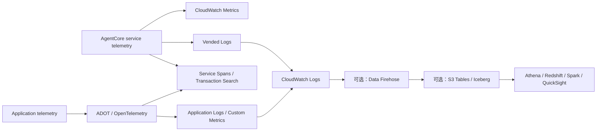

# AgentCore 与 Managed Knowledge Base 可观测性蓝图

复核日期：2026-08-05

本文定义 Managed Knowledge Base、AgentCore Runtime、Memory、Gateway、内置工具
及自定义 Agent 的可观测性最低架构、实验方法和长期数据治理。它是
[企业治理蓝图](ENTERPRISE_GOVERNANCE_BLUEPRINT.md)的专项展开。

## 1. 设计结论

可观测性不是 Console 中的单一开关，也不是一张 Dashboard。生产基线必须同时
回答：

1. 服务是否正常，错误率、延迟、吞吐和成本趋势如何。
2. 某个请求做了什么，失败原因和输入输出边界是什么。
3. 一个请求跨 Agent、Gateway、Tool、KB 和模型的因果链是否完整。
4. 证据是否按数据分类完成脱敏、访问控制、保留和删除。

Metrics、Logs、Traces 的职责不同，不能相互替代：

| 信号 | 主要问题 | 不足 |
| --- | --- | --- |
| Metrics | 是否发生、规模和趋势如何 | 不能重建单次请求 |
| Logs | 某一步做了什么、为何失败 | 不天然表达跨服务父子关系 |
| Traces | 请求跨步骤的顺序、耗时和因果关系 | 不能替代审计日志和长期趋势指标 |

## 2. 两类遥测必须分开



### 2.1 Service-provided telemetry

由 AgentCore 或 Bedrock 服务生成，用于描述服务边界内的调用、错误、延迟和
资源操作：

- AgentCore Runtime 默认创建 service log group。
- Memory 和 Gateway 不自动配置日志目的地，必须显式配置 log delivery。
- 内置工具默认不提供应用日志；自定义代码日志需要自行投递。
- Gateway 指标在 CloudWatch 中查看，不应只检查 Generative AI Observability
  页面。
- Managed KB 运行指标位于 `AWS/Bedrock/KnowledgeBases`；摄入日志需要单独
  配置。

### 2.2 Application telemetry

应用、编排器、本地代理和自定义 Agent 必须决定并验证自己的 ADOT/OTEL
instrumentation。即使 Runtime 已启用托管观测，也不能据此假设以下业务步骤已
完整出现：

- prompt、模型和检索配置版本；
- 路由、重试、降级和 Guardrail 决策；
- 自定义检索、生成、校验和业务 KPI；
- 应用到 Gateway/KB 的 correlation context 传播。

应用 span 和日志不得写入凭据、Token、完整敏感 Prompt、未脱敏 Raw Chunk 或
Tool Payload。

## 3. 一次性账户与 Region 基线

### 3.1 CloudWatch Transaction Search

每个承载实验或生产流量的账户和 Region 都必须确认 Transaction Search 已启用，
并允许摄入 OpenTelemetry spans。它是查看 AgentCore service spans/traces 的
前提，不是某个 Gateway 或 KB 自动开启的资源属性。

门禁证据至少包括：

- account alias 或脱敏账户引用、Region 和复核时间；
- Transaction Search 配置状态；
- 一个已知测试请求的 trace ID；
- root span、预期 child spans 和缺失链路。

### 3.2 Log delivery

建立资源级 delivery inventory，至少记录：

| 字段 | 说明 |
| --- | --- |
| Resource | 类型、逻辑 ID、ARN 的受控证据位置 |
| Log type | application/service/ingestion/audit |
| Destination | CloudWatch Logs、S3 或 Firehose |
| Encryption | KMS Key Owner 与策略 |
| Retention | 在线排障和长期分析各自期限 |
| Data class | K0-K3、PII/Secret/Raw Payload 策略 |
| Health | delivery failure、throttle、lag 告警 |

Gateway 和 Memory 需要显式 delivery。配置 CloudWatch Logs 目的地时，默认日志
组形式为
`/aws/vendedlogs/bedrock-agentcore/{resource-type}/APPLICATION_LOGS/{resource-id}`。
S3 更适合归档，CloudWatch Logs 更适合近实时排障，Firehose 是投递与转换层。

### 3.3 IAM 与数据保护

- 创建和管理 log delivery 的 Role 与资源策略必须最小权限。
- K1-K3 日志必须明确 KMS、跨账户汇聚、查询和删除权限。
- 日志和 span attribute 使用字段白名单；未知字段默认丢弃或脱敏。
- 测试用 PII marker 只能使用虚构值，且门禁应证明 marker 未进入长期存储。
- CloudTrail 负责 API 审计，不替代应用日志或请求 trace。

## 4. 资源测试矩阵

| 资源 | 功能路径 | Metrics | Logs | Traces | 关键负向路径 |
| --- | --- | --- | --- | --- | --- |
| Runtime / Harness | 调用、模型、Tool、并发 | count、error、latency、token | service + application | agent、model、tool 子 span | timeout、模型错误、权限拒绝 |
| Memory | write、read、TTL | operation、error、latency | 显式 delivery | memory operation span | TTL 到期、session 不存在 |
| Gateway | initialize、list、call | invocation、usage、latency、throttle | 显式 delivery | gateway/target/tool spans | target 失败、签名和权限错误 |
| Built-in tool | Browser/Code Interpreter 等 | 调用、错误、延迟、成本 | 自定义日志按需配置 | tool span 与父调用 | 输入错误、配额、权限拒绝 |
| Managed KB | ingest、retrieve、agentic retrieve | KB namespace + 应用质量指标 | 摄入日志 + 调用应用日志 | Agentic events + 应用 trace | 摄入失败、零结果、Throttle |

Managed KB Console 中的 Observability 不证明 Gateway logs、Gateway traces 或
应用 instrumentation 已配置。每个资源必须分别检查。

## 5. 实验协议

每次 E00-E07 实验都必须使用
[观测证据模板](../experiments/observability-evidence.template.md)，并执行：

1. 一条成功路径。
2. 一条不会破坏共享环境的可控失败路径。
3. 在相同 UTC 时间窗内查询 Metrics、Logs 和 Traces。
4. 用 request ID、runtime session ID 或 trace ID 关联同一请求。
5. 将“信号不适用”和“信号未配置/丢失”明确区分。
6. 验证日志和 span 未出现禁止字段。
7. 记录 telemetry 延迟、查询成本和 cleanup。

实验通过不是“Console 有图”，而是功能结果和遥测结果都满足预期，且主要失败
能够定位到具体资源、步骤、错误类别和 Owner。无法取得某类信号时，结果必须为
`GAP`，不能推断为没有错误。

## 6. 指标、SLO 与告警

阈值必须来自业务 SLO 和负载基线，不应复制统一数值。最低告警族：

| 告警族 | 典型维度 | 目的 |
| --- | --- | --- |
| Error rate | resource、operation、target/tool | 发现系统或局部失败 |
| p95/p99 latency | operation、model、retriever | 定位持续变慢 |
| Throttle/quota | service、account、Region | 发现容量边界 |
| KB ingestion | job、data source、status | 发现 failed/skipped |
| Retrieval quality | corpus version、query set | 发现零结果、召回和引用回归 |
| Session/memory | operation、outcome | 发现 TTL 和会话生命周期错误 |
| Delivery pipeline | destination、delivery status | 防止服务正常但证据丢失 |
| Cost | model、token、query、log bytes | 发现异常用量 |

Dashboard 至少同时显示服务健康、检索质量、发布版本和观测管道健康。Metrics
到达有聚合延迟，实验记录必须注明查询等待时间，不能把暂未出现判定为零。

## 7. Correlation Schema

长期分析事件以
[`schemas/observability-event.schema.json`](../schemas/observability-event.schema.json)
为契约。核心字段包括：

```text
event_time, account_id, region, environment,
resource_type, resource_arn, agent_name,
trace_id, span_id, parent_span_id,
request_id, runtime_session_id,
gateway_id, target_name, tool_name,
operation, outcome, error_code,
latency_ms, model_id, input_tokens, output_tokens,
estimated_cost, prompt_version, payload_redacted
```

规则：

- ID 在服务间原样传播；无法传播时记录显式映射，禁止按时间模糊猜测。
- `trace_id`、`request_id` 等高基数字段用于检索和关联，不作为 Iceberg 分区键。
- account、ARN 和用户标识只存在受控运行证据中，不提交 Git。
- Schema 采用显式版本；破坏性字段变化发布新版本并双写迁移。
- `payload_redacted=true` 是长期事件入表门禁，不代表源日志已天然安全。

## 8. 长期分析架构

推荐的可选路径：

```text
AgentCore / application logs
  -> CloudWatch Logs
  -> subscription filter
  -> Amazon Data Firehose
  -> Amazon S3 Tables (Apache Iceberg)
  -> Athena / Redshift / Spark / QuickSight
```

组件职责：

- CloudWatch Logs：近实时排障、Logs Insights、metric filter 和告警。
- Firehose：缓冲、转换、压缩、路由、重试和投递；不是查询引擎。
- S3 Tables：长期结构化分析、ACID/快照语义和表维护；不是实时 log tail。

只需要日常排障时，CloudWatch Logs 即可，不应为架构完整性强制增加湖仓。需要
跨月分析 Agent 质量、工具可靠性、成本或多信号关联时，再启用长期路径。

### 8.1 入表门禁

- Firehose 前或 transform 中执行字段白名单、类型规范化和脱敏。
- 错误记录写入受控 S3 error prefix，并对失败率、重试耗尽和 lag 告警。
- 默认使用 append-only 事件；需要更新/删除时定义稳定 unique key。
- Schema evolution 必须经过兼容性检查和数据 Owner 审批。
- 推荐按 `event_date`、`environment`、`resource_type` 低基数字段分区。
- 禁止按 `trace_id`、`request_id`、用户或 session 等高基数字段分区。

### 8.2 保留与删除

- CloudWatch 在线保留与 Iceberg 长期保留分别定义。
- S3 Tables 的 compaction、snapshot expiration 和 unreferenced file cleanup
  必须显式复核；自动维护不等于企业保留策略。
- 删除语义必须覆盖源日志、Firehose backup/error objects、Iceberg snapshots、
  查询结果缓存和导出副本。
- Legal Hold 优先于自动过期；解除后再按批准流程删除。

## 9. 运营周期

| 周期 | 活动 |
| --- | --- |
| 每次实验/发布 | 成功和失败证据、三信号关联、脱敏抽样、cleanup |
| 每周 | 告警有效性、delivery lag/error、缺失 trace 和异常成本 |
| 每月 | 日志留存、查询权限、Dashboard/SLO、Schema drift |
| 每季度 | Transaction Search、delivery inventory、KMS/IAM、恢复查询演练 |
| 每半年 | 长期表维护、删除/Legal Hold、采样与成本策略 |

## 10. 官方依据

- [AgentCore Observability 入门与 Transaction Search](https://docs.aws.amazon.com/bedrock-agentcore/latest/devguide/observability-get-started.html)
- [AgentCore 资源 Observability 配置](https://docs.aws.amazon.com/bedrock-agentcore/latest/devguide/observability-configure.html)
- [AgentCore Gateway 生成的指标、日志和 Spans](https://docs.aws.amazon.com/bedrock-agentcore/latest/devguide/observability-gateway-metrics.html)
- [查看 AgentCore Observability 数据](https://docs.aws.amazon.com/bedrock-agentcore/latest/devguide/observability-view.html)
- [Managed Knowledge Base Observability](https://docs.aws.amazon.com/bedrock/latest/userguide/kb-managed-observability.html)
- [Knowledge Base 摄入日志](https://docs.aws.amazon.com/bedrock/latest/userguide/knowledge-bases-logging.html)
- [Firehose Apache Iceberg Destination](https://docs.aws.amazon.com/firehose/latest/dev/apache-iceberg-destination.html)
- [Amazon S3 Tables](https://docs.aws.amazon.com/AmazonS3/latest/userguide/s3-tables.html)
